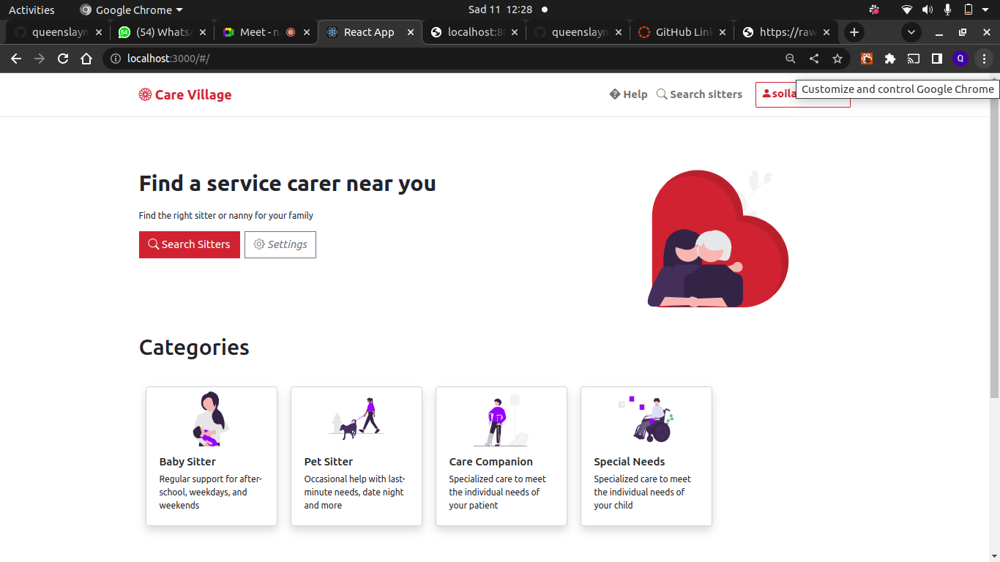
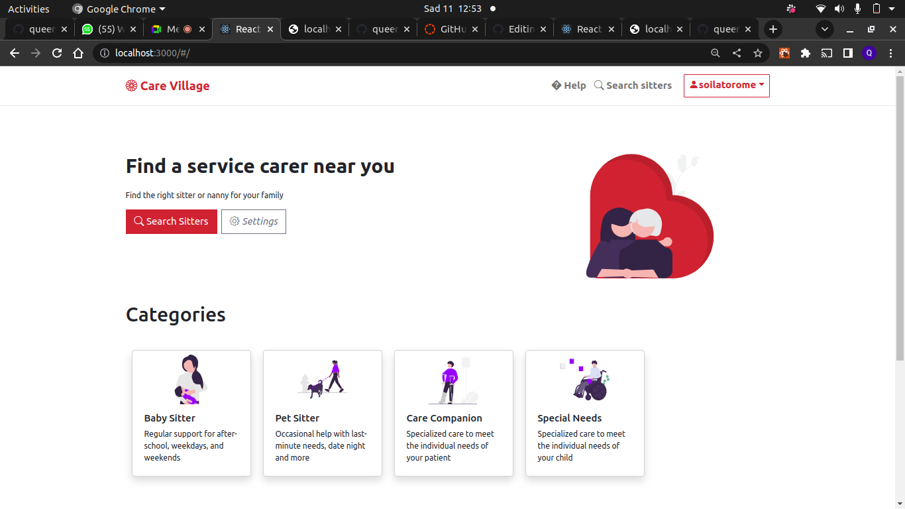

# PROJECT NAME

CARE VILLAGE
## BACKEND LINK
The backend for the project is at https://github.com/queenslaynaila/Care-Village-Backend

## Table of Contents

1. [Description](#description)
2. [Technologies used](#technology-used)
3. [Setup](#setup)
4. [How to use the website](#how-to-use-the-website)
5. [Licence](#licence)
6. [AuthorS info](#authorS-info)

# DESCRIPTION

 The main goal of this project is to connect people seeking care services like a baby sitter, a nanny , a pet carer , a special needs care services to those who are offering such services

## TECHNOLOGY USED
    Project is created with:
            -Ruby and Sinatra for backend
            -React for the frontend
            -Material-ui,Custom css and Boostrap ui for the styling

## HOW TO USE THE WEBSITE

On page load the user will see the homepage with the homepage

On the homepage if a user want to find services he or she can sign up as a client , if he or she wants to offer such services he or she can sign up as a client
If he signs up as a client he or she will see the following

On cliecking serach sitters he or sh will see a alist of sitters in the app.
## LICENCE

[MIT](LICENCE)
Copyright (c) 2022 Jema Queenslay Naila

## AUTHORS INFO
 Project is created by:
            -Queenslay Jema
            -Soila Torome
            -Brian Wangombe
            -Stephen Onchieku
            -Anne WAirumu

## CONTACT INFO
For any query contact either of them at queenslayjema@gmail.com,ann.mwangi@student.moringaschool.com,brian.wangombe@student.moringaschool.com,sammy.wekesa@student.moringaschool.com,stephen.onchieku@student.moringaschool.com,soila.torome@student.moringaschool.com.

